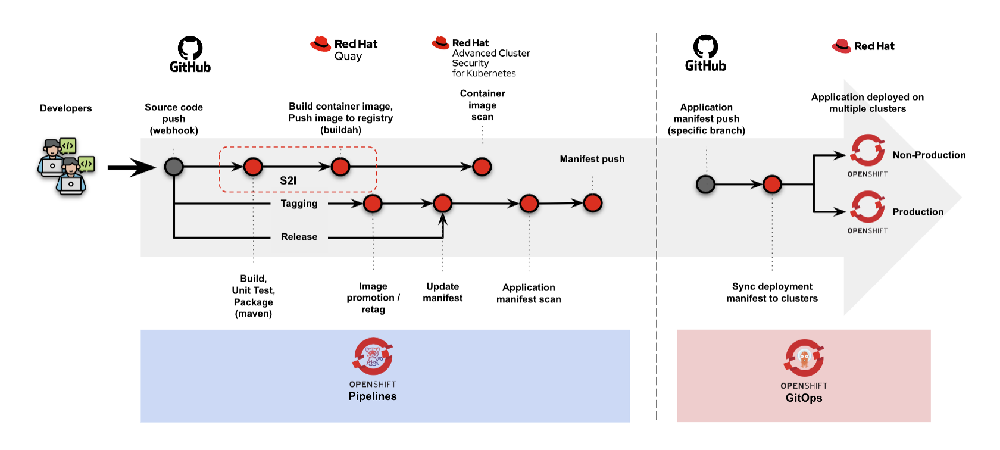

# TODO Application GitOps

## Overall architecture




## Prerequisites

- All projects are stored in GitHub repository
  - TODO application (Java)
    > Fork from this project: https://github.com/sgnus-infra/todo-application
  - TODO application (.NET)
    > Fork from this project: https://github.com/sgnus-infra/todo-dotnet-application
  - TODO application infrastructure configuration
    > Fork from this project: https://github.com/sgnus-infra/todo-application-infra
- [Openshift Pipeline](https://www.redhat.com/en/technologies/cloud-computing/openshift/pipelines) operator is installed
  > v1.11.1
- [Openshift GitOps](https://www.redhat.com/en/technologies/cloud-computing/openshift/gitops) operator is installed
  > v1.8.5
- [ACS](https://www.redhat.com/en/technologies/cloud-computing/openshift/advanced-cluster-security-kubernetes) operator is installed and configured
  > v4.2.2
- [Quay](https://www.redhat.com/en/technologies/cloud-computing/quay) operator is installed
  > v3.9.3
  > This operator requires Red Hat OpenShift Data Foundation operator
- [Sealed Secret operator (Bitnami)](https://github.com/bitnami-labs/sealed-secrets) is installed
  > latest version
- Required namespaces:
  - For pipeline and deployment to Dev:
    - `todo-dev`
  - For deployment to SIT and Prod:
    - `todo-sit`
    - `todo-prod`


## Notes for the implementation

### Check role for openshift-gitops namespace

```
oc patch cm/argocd-rbac-cm -n <target-namespace> --type=merge -p '{"data": { "policy.default": "role:admin" } }'
```

### Give permission to Service Account for specific deployment namespace

```
oc adm policy add-role-to-user admin system:serviceaccount:openshift-gitops:openshift-gitops-argocd-application-controller -n <target-namespace>
```

### Command to generate sealed secrets from secrets YAML

```
kubeseal --format yaml < [source-secrets.yaml] > [target-sealed-secrets].yaml
```
> Notes: Get all necessary token from all operators to create secrets. Then generate the sealed secrets with `kubeseal` command.